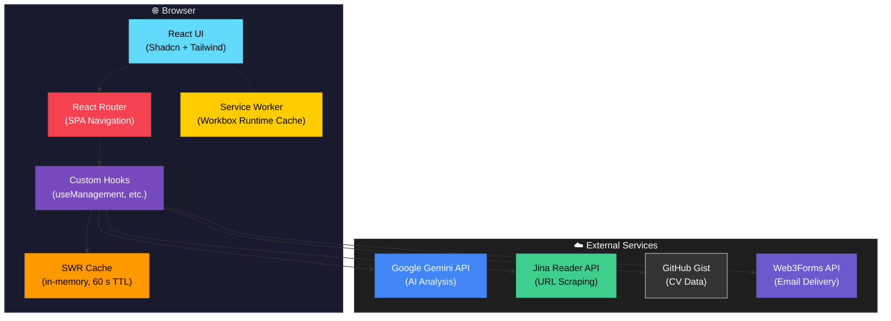
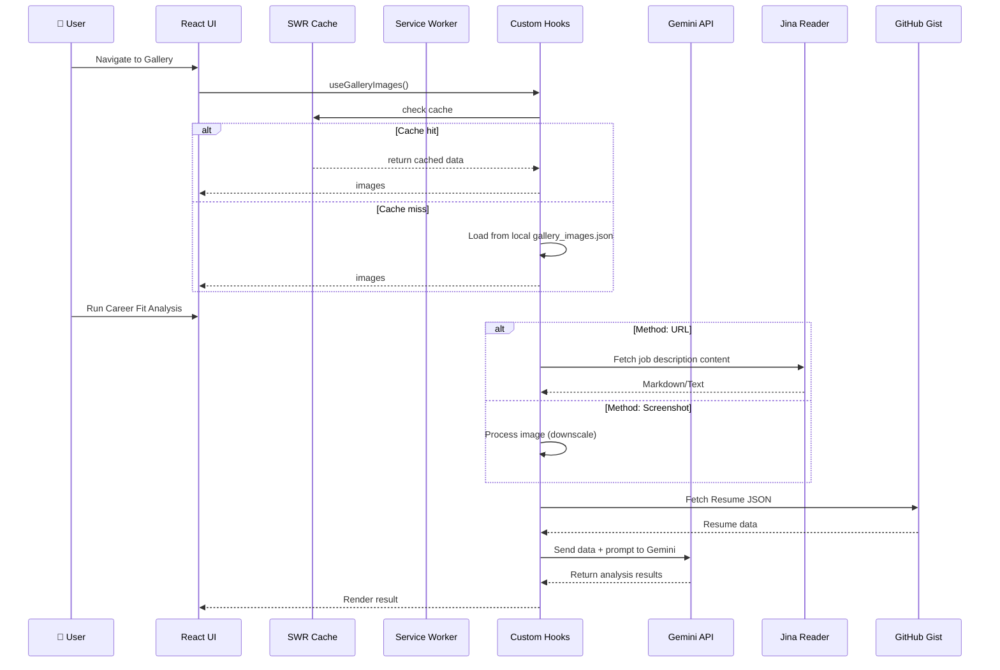

# Architecture

## System Overview
Dew Drops is a modern, mobile-first React application built to showcase a personal portfolio, CV match maker, blog, photography, and travelogue. It uses Vite for build tooling and HMR, React Router for client-side navigation, and Tailwind CSS and Shadcn/ui for styling and components. The application operates entirely with local data and integrates with external AI services for advanced features.

## Architectural Decisions
- **Mobile First Approach**
    - **Context**: The application constitutes a personal portfolio designed to be primarily consumed on mobile devices.
    - **Decision**: All UI components are explicitly designed using mobile-first Tailwind CSS classes, adding minimum breakpoints only for larger displays if necessary.
    - **Consequences**: Ensures an optimal and uniform user experience across smartphones while reducing mobile layout reflow issues.

- **Vite & React Ecosystem**
    - **Context**: Needed high performance, modularity, and rapid development capabilities.
    - **Decision**: Migrated to Vite for the build process, utilizing React 18 functional components and custom hooks for business logic separation (`useManagement`, `useBlogManagement`, etc.).
    - **Consequences**: Significantly improved developer experience (DX) and build times.

- **Two-Layer Caching Strategy**
    - **Context**: Gallery and other public data pages benefit from caching to ensure fast perceived load times on repeat visits.
    - **Decision**: A two-layer cache is used:
        1. **SWR (in-memory)** — custom hooks (`useGalleryImages`, `useGalleryManagement`) use SWR with `keepPreviousData: true` and `dedupingInterval: 60 s`. Navigating back to a page is instant; a background revalidation runs silently.
        2. **Workbox runtime cache (service worker)** — `vite-plugin-pwa` is configured with `CacheFirst` on local image files (1 day TTL, 200 entries).
    - **Consequences**: Repeat visits and page navigation are dramatically faster.

## Diagrams

### Web Application Architecture

### Data Flow (Match-CV & Gallery)

