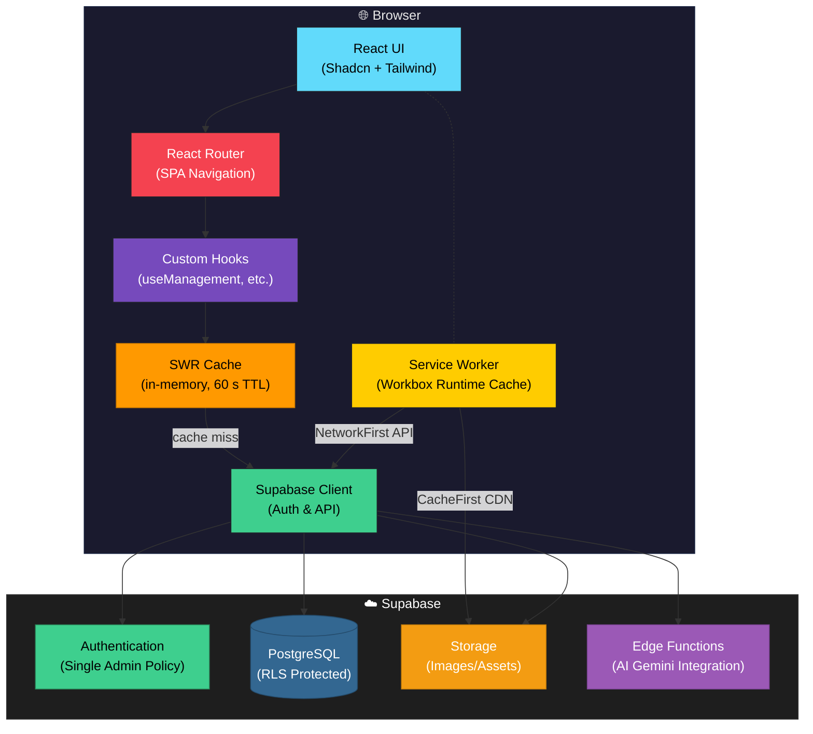
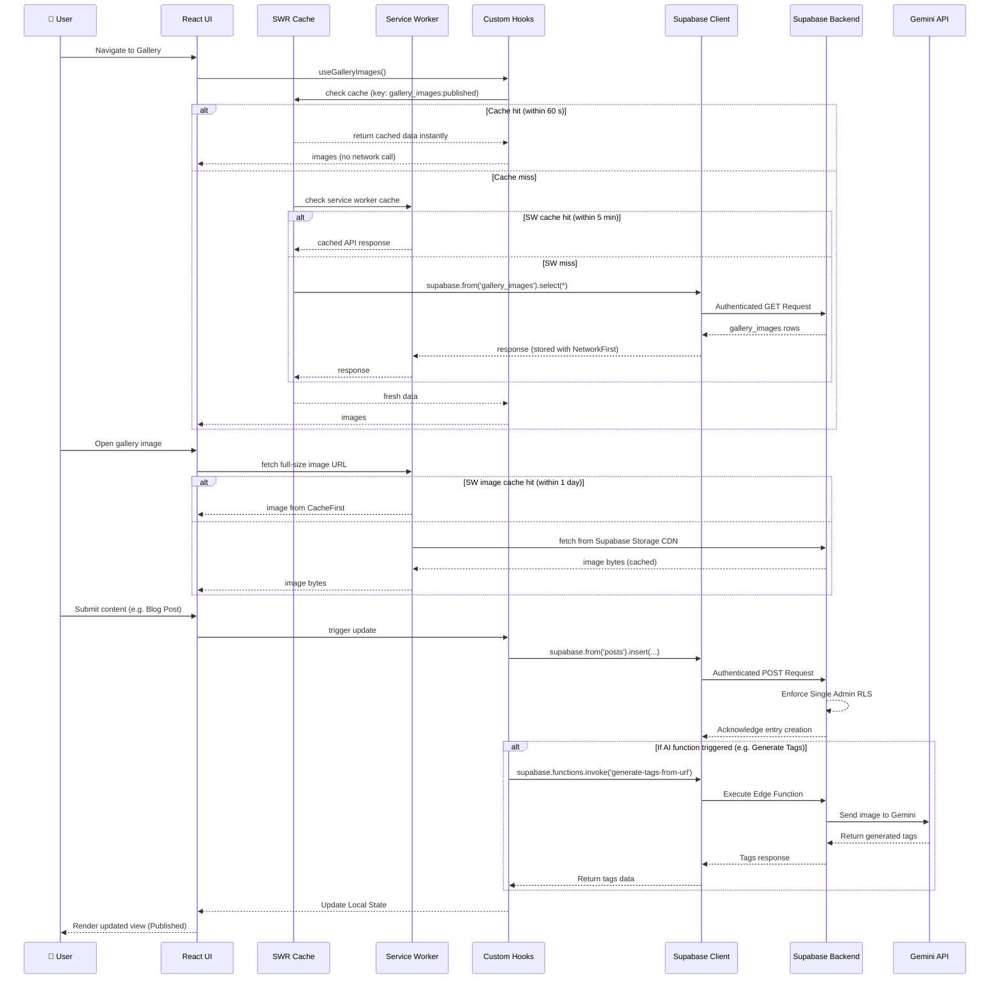

# Architecture

## System Overview
Dew Drops is a modern, mobile-first React application built to showcase a personal portfolio, CV match maker, blog, photography, and travelogue. It uses Vite for build tooling and HMR, React Router for client-side navigation, Tailwind CSS and Shadcn/ui for styling and components, and Supabase for backend database and authentication. A key strict requirement is a single-admin architecture where all write operations (creating blogs, uploading photos, adding travel pins, editing the CV) are securely restricted strictly to a single admin user.

## Architectural Decisions
- **Mobile First Approach**
    - **Context**: The application constitutes a personal portfolio designed to be primarily consumed on mobile devices.
    - **Decision**: All UI components are explicitly designed using mobile-first Tailwind CSS classes, adding minimum breakpoints only for larger displays if necessary.
    - **Consequences**: Ensures an optimal and uniform user experience across smartphones while reducing mobile layout reflow issues.

- **Single Admin Restriction**
    - **Context**: Content creation should exclusively be handled by the portfolio owner to prevent unauthorized edits.
    - **Decision**: Row Level Security (RLS) on Supabase and rigorous client-side route guards strictly allow only one distinct authenticated admin to perform PUT/POST/DELETE operations.
    - **Consequences**: Vastly simplifies role management and improves overall security against content tampering, though prevents any future multi-user content creation without architectural refactoring.

- **Vite & React Ecosystem**
    - **Context**: Needed high performance, modularity, and rapid development capabilities.
    - **Decision**: Migrated to Vite for the build process, utilizing React 18 functional components and custom hooks for business logic separation (`useManagement`, `useBlogManagement`, etc.).
    - **Consequences**: Significantly improved developer experience (DX) and build times.

- **Two-Layer Caching Strategy**
    - **Context**: Gallery and other public data pages were making fresh Supabase network requests on every mount, causing slow perceived load times on repeat visits.
    - **Decision**: A two-layer cache is used:
        1. **SWR (in-memory)** — custom hooks (`useGalleryImages`, `useGalleryManagement`) use SWR with `keepPreviousData: true` and `dedupingInterval: 60 s`. Navigating back to a page is instant; a background revalidation runs silently.
        2. **Workbox runtime cache (service worker)** — `vite-plugin-pwa` is configured with two runtime strategies:
           - `NetworkFirst` on Supabase REST API responses (5 min TTL) — always tries the network first, serves cache when offline.
           - `CacheFirst` on Supabase Storage CDN image files (1 day TTL, 200 entries) — gallery images are immutable in practice (file_name encodes upload timestamp), so serving from cache is safe and eliminates the CDN round-trip entirely on revisit.
    - **Consequences**: Gallery cold-start is unchanged (first load still hits Supabase), but repeat visits and page navigation are dramatically faster. Image files are ~60–80% smaller thanks to Supabase Storage transform parameters (`?width=600&quality=75`) applied to thumbnails.

## Diagrams

### Web Application Architecture

### Data Flow

